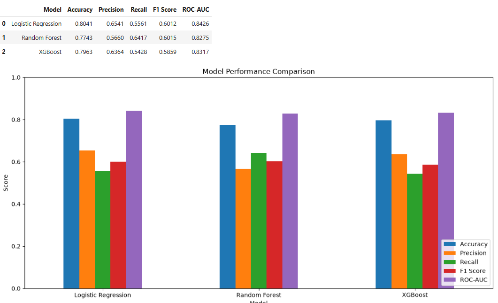
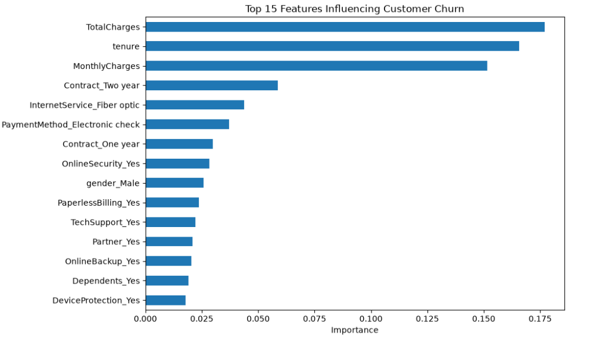

# Customer-Churn-Prediction
Machine learning project to analyze customer churn patterns and predict high-risk telecom customers using Logistic Regression, Random Forest, and XGBoost.
# Customer Churn Prediction

## 📌 Project Overview

Customer churn refers to customers discontinuing their services with a company. Predicting customer churn helps businesses identify customers who are at risk of leaving and take suitable retention actions.

This project uses machine learning to analyze customer data from a telecommunications company, identify patterns associated with churn, and predict whether a customer is likely to leave.

The project covers data cleaning, exploratory data analysis, machine learning model development, model evaluation, feature importance analysis, and customer churn prediction.

---

## 🎯 Project Objective

- Analyze customer data to understand churn patterns.
- Identify important factors associated with customer churn.
- Build machine learning models to predict customer churn.
- Compare the performance of different classification models.
- Identify customers who have a higher probability of churning.
- Demonstrate churn prediction for a brand-new customer.
- Provide business recommendations for customer retention.

---

## 📂 Dataset

The project uses the **IBM Telco Customer Churn Dataset**.

### Dataset Details

- **Records:** 7,043
- **Features:** 21
- **Target Variable:** Churn
- **Industry:** Telecommunications
- **Churn Classes:** Yes / No

The dataset contains information about customer demographics, services, contracts, payment methods, tenure, monthly charges, and total charges.

### Data Source

Kaggle - IBM Telco Customer Churn Dataset

---

## 🛠️ Technologies Used

- Python
- Pandas
- NumPy
- Matplotlib
- Seaborn
- Scikit-learn
- XGBoost
- Jupyter Notebook

---

## 🔄 Project Workflow

1. Data Loading
2. Data Inspection
3. Data Cleaning
4. Missing Value Handling
5. Exploratory Data Analysis
6. Feature Encoding
7. Train-Test Split
8. Machine Learning Model Training
9. Model Evaluation
10. Feature Importance Analysis
11. Customer Churn Prediction
12. New Customer Prediction
13. Business Insights and Recommendations

---

## 🤖 Machine Learning Models

Three classification models were trained and evaluated:

- Logistic Regression
- Random Forest
- XGBoost

### Model Performance

| Model | Accuracy | Precision | Recall | F1 Score | ROC-AUC |
|---|---:|---:|---:|---:|---:|
| Logistic Regression | 80.41% | 65.41% | 55.61% | 60.12% | 84.26% |
| Random Forest | 77.43% | 56.60% | 64.17% | 60.15% | 82.75% |
| XGBoost | 79.63% | 63.64% | 54.28% | 58.59% | 83.17% |

### 🏆 Best Overall Model

**Logistic Regression** achieved the highest overall performance:

- **Accuracy:** 80.41%
- **ROC-AUC:** 84.26%

Random Forest achieved the highest recall at **64.17%**, making it useful when the priority is to identify as many potential churners as possible.

---

## 📊 Model Performance Comparison



---

## 📌 Important Features

The Random Forest model identified several important features for churn prediction.

The top features included:

- Total Charges
- Tenure
- Monthly Charges
- Contract Type
- Internet Service
- Payment Method
- Online Security
- Paperless Billing
- Tech Support
- Partner Status



> Feature importance shows which variables were useful to the model for prediction. It does not necessarily mean that these factors directly cause customer churn.

---

## 🔍 Key Findings

### Contract Type

Customers with month-to-month contracts had the highest churn rate:

- Month-to-month: **42.71%**
- One year: **11.27%**
- Two year: **2.83%**

### Payment Method

Customers using electronic checks had the highest churn rate at **45.29%**.

### Internet Service

Fiber optic customers had a churn rate of **41.89%**, compared with **18.96%** for DSL customers.

### Online Security

Customers without Online Security had a churn rate of **41.77%**, compared with **14.61%** among customers with Online Security.

### Tech Support

Customers without Tech Support had a churn rate of **41.64%**, compared with **15.17%** among customers with Tech Support.

### Customer Tenure

Newer customers showed significantly higher churn:

- 0–12 months: **47.44%**
- 13–24 months: **28.71%**
- 25–36 months: **21.63%**
- 37–48 months: **19.03%**
- 49–60 months: **14.42%**
- 61–72 months: **6.61%**

Customers in their first year are therefore an important group for retention efforts.

---

## 💡 Business Recommendations

Based on the analysis:

- Focus retention campaigns on customers during their first year.
- Encourage month-to-month customers to move to longer-term contracts.
- Investigate the reasons behind the high churn among electronic-check users.
- Promote Online Security and Tech Support services.
- Review pricing and perceived value for customers with higher monthly charges.
- Investigate customer satisfaction and service quality among fiber optic users.
- Use churn probability scores to identify high-risk customers and provide targeted retention offers.

---

## 🔮 Customer Churn Prediction

The trained Logistic Regression model predicts churn for customers in the test dataset.

The prediction output includes:

- Predicted churn status
- Churn probability
- Risk level

Customers are classified into:

- **Low Risk**
- **Medium Risk**
- **High Risk**

The generated predictions are saved in:

`customer_churn_predictions.csv`

---

## 🆕 New Customer Prediction

The project also demonstrates how the trained model can predict churn for a completely new customer.

The model takes customer information such as:

- Tenure
- Contract type
- Internet service
- Payment method
- Monthly charges
- Support services
- Other customer details

and returns:

- Predicted churn status
- Churn probability
- Risk level

This demonstrates how the model could be used as a basic customer retention support tool.

---

## 📁 Project Files

```text
Customer-Churn-Prediction/
│
├── CustomerChurn Project.ipynb
├── WA_Fn-UseC_-Telco-Customer-Churn.csv
├── customer_churn_predictions.csv
├── model_performance_comparison.png
├── feature_importance.png
└── README.md
